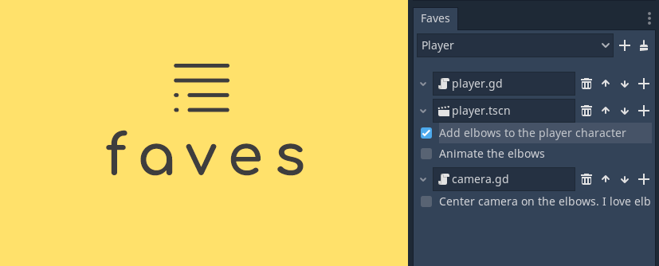

# Faves 1.0 - 

A better implementation of the Favorites feature in Godot.

## :muscle: Features

* A dock that sits in your Godot Editor and allows you to drag your favorite files into it.
* Multiple favorites lists; you can have one for the player, one for UI, one for enemies, etc.
* Add tasks to your favorite files. This works like a to-do list for each script, scene or resource.

## :file_folder: Installation

To install Faves, download it as a ZIP archive. All releases are listed here: [releases](https://github.com/ad1337/faves/releases). Then extract the ZIP archive and move the `addons/` folder it contains into your project folder. Then, enable the plugin in Godot's project settings.

If you want to know more about installing plugins you can read the [Godot docs page](https://docs.godotengine.org/en/stable/tutorials/plugins/editor/installing_plugins.html).

## 📃 Credits
Made by [Lucas Molina](https://github.com/ad1337).

Follow me on [Twitter](https://www.twitter.com/ad1337)!

[MIT License](LICENSE.md)